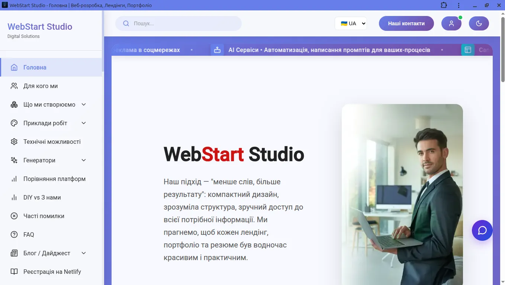
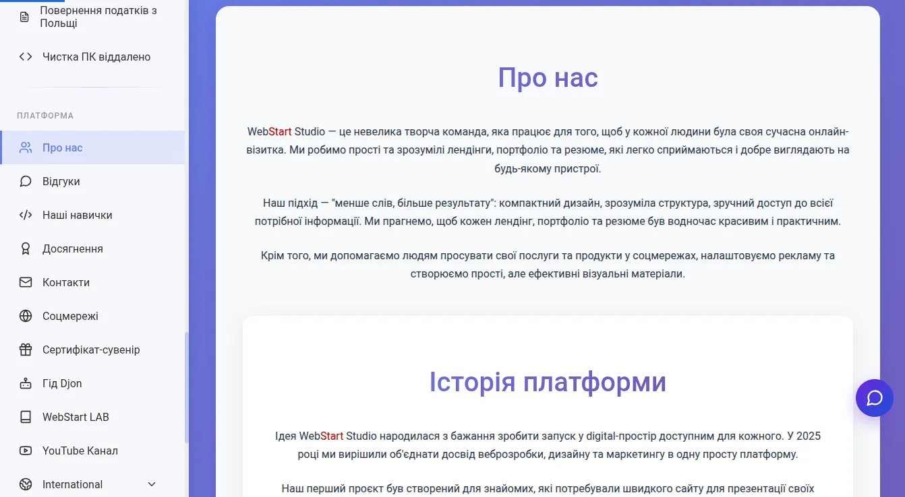

# WebStart Studio

> ⚠️ **Важливо:** Це публічна фронтенд частина платформи WebStart Studio.
> Репозиторій призначений для ознайомлення з архітектурою та кодом.
> Бекенд є закритим з міркувань безпеки — повний запуск проєкту локально неможливий.

[](https://reactjs.org/)
[](https://www.typescriptlang.org/)
[](LICENSE)
[](CONTRIBUTING.md)

> Open-source community platform for web developers — forum, team chat, client dashboard, admin panel.

🌐 **Live Demo:** https://web-start-studio.netlify.app

---






---

## Stack

- **Frontend:** React 18 + TypeScript + Vite + Tailwind CSS
- **Backend:** Node.js + Express + MySQL
- **Auth:** JWT
- **i18n:** i18next (UA / EN)
- **Deploy:** Netlify + Railway

---

## Features

- Forum with categories, posts, comments, reactions, pinning, admin moderation
- Team chat
- Client dashboard
- Admin panel
- Dark mode
- Fully responsive
- Multilingual (Ukrainian / English)

---

## Quick Start

```bash
git clone https://github.com/ViktorPro1/webstart-studio-react-app.git
cd webstart-studio-react-app
npm install
npm run dev
```

Open http://localhost:5173

---

## Scripts

| Command             | Description              |
| ------------------- | ------------------------ |
| `npm run dev`       | Start dev server         |
| `npm run build`     | Production build         |
| `npm run preview`   | Preview production build |
| `npm run lint`      | Run ESLint               |
| `npm run typecheck` | Check TypeScript types   |

---

## Project Structure

```
webstart-studio-react-app/
├── client/
│   └── src/
│       ├── components/
│       ├── pages/
│       ├── contexts/
│       ├── types/
│       └── utils/
├── server/
│   ├── routes/
│   └── middleware/
└── docs/
    └── screenshots/
```

---

## Contributing

1. Fork the repo
2. Create a feature branch (`git checkout -b feature/my-feature`)
3. Commit your changes (`git commit -m 'Add my feature'`)
4. Push (`git push origin feature/my-feature`)
5. Open a Pull Request

---

## Author

**Viktor** — [@ViktorPro1](https://github.com/ViktorPro1) · webstartstudio978@gmail.com

---

## License

MIT — see [LICENSE](LICENSE)

---

⭐ If you find this useful, give it a star!
